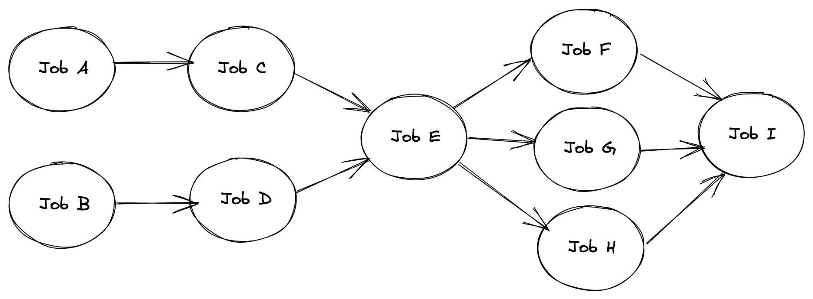

# Parallel Job Scheduler With Dependent Jobs

### Problem Statement

Write java program for Parallel Job Scheduler. Implement the generic solution in Java using Multithreading, given a list of jobs and its children jobs.

For example:

-   Job A and Job B are the starting jobs which can be started in parallel
-   Job C is a child of Job A and Job D is a child of Job B. So, Job C needs to wait until Job A completes and Job D needs to wait till Job B completes
-   Job E is a child of both Job C and Job D. Therefore, it needs to wait until both Job C and Job D completes.
-   Job F, Job G and Job H are the children of Job E. So, as soon as Job E completes, all three of the children jobs can be started in parallel.
-   Finally, Job I is the child of all three jobs Job F, Job G and Job H. So, Job I needs to wait till Job F, Job G and Job H to complete.

This diagram shows the flow of the example described above

### Solution

This repository provides an implementation of a parallel job scheduler that can schedule dependent jobs in parallel. The scheduler uses go routines to execute the jobs and ensures that child jobs are not executed before their parent jobs are completed. The scheduler ensures that the jobs are executed in the order of their dependencies. It uses the CountDownLatch class to ensure that the child jobs are not executed before their parent jobs are completed. The go routines are waited on using the WaitGroup class to ensure that the main thread does not exit before all the jobs are completed.
